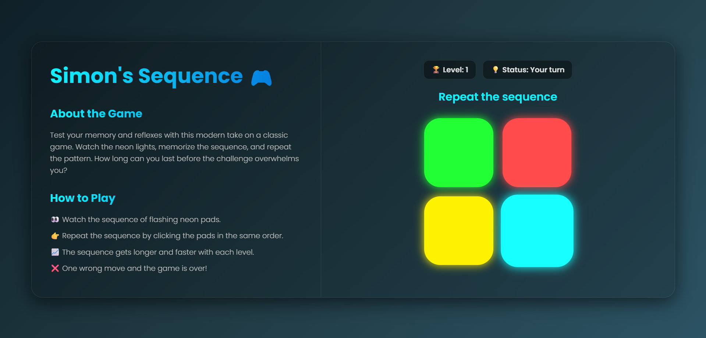
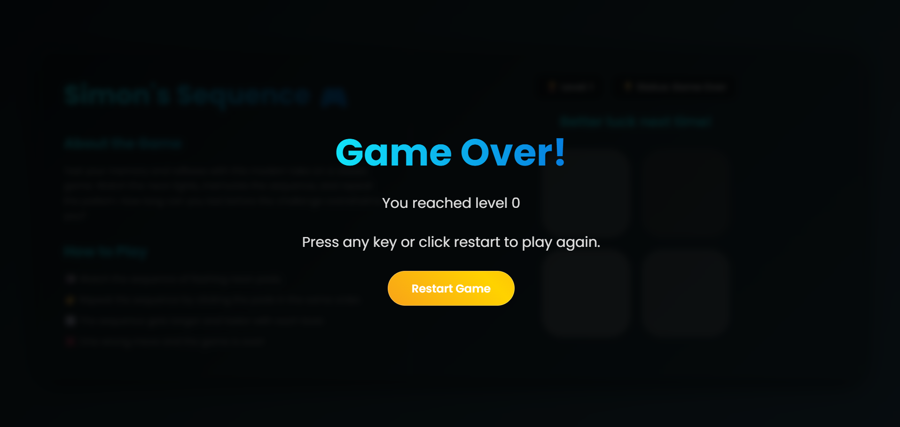

<h1 align="center">🧠 Simon's Sequence - A Memory Game</h1>

<p align="center">
  
  
  
</p>

---

## 🖥️ Project Overview

**Simon's Sequence** is a sleek and modern web-based memory game inspired by the classic electronic game "Simon." It challenges players to memorize and repeat an ever-increasing sequence of colors and lights. Built with vanilla HTML, CSS, and JavaScript, this project showcases a responsive UI with a cool glassmorphism and neon aesthetic.

---

## 🌍 Live Demo

🧑‍💻 **Check it Live Here**:  
🔗 https://simon-sequence.vercel.app/

---

## 🚀 Features

-   🧠 **Classic Memory Gameplay:** Watch the sequence, remember the pattern, and repeat it.
-   📈 **Progressive Difficulty:** The sequence gets one step longer with every level you complete.
-   🎨 **Stunning UI/UX:** A beautiful and modern interface featuring a dark theme, neon-glowing buttons, and a glass-like container.
-   📱 **Fully Responsive:** The layout seamlessly adapts to all screen sizes, from mobile phones to desktops.
-   📊 **Real-time Feedback:** Instantly know your level, game status, and see messages guiding you through the game.
-   🎉 **Game Over Screen:** When you make a mistake, a clean "Game Over" screen displays your final score.
-   ⌨️ **Keyboard Support:** Start or restart the game easily by pressing any key.

---

## 🛠️ Tools & Technologies Used

<p align="center">
  
  
  
</p>

---

## 📸 Screenshots

<div align="center">
  
  
</div>

---

## 🚀 Getting Started Locally

This is a static web project and does not require any build steps or dependencies.

### 1️⃣ Clone the Repository (Optional)
If you have git installed:
```bash
git clone https://github.com/samjaiswal51/Simon-s-Sequence.git
```
Alternatively, you can just download the index.html, style.css, and app.js files.

### 2️⃣ Open the Game
Navigate to the project folder and open the index.html file in your favorite web browser.

That's it! The game is ready to play.

---

### 🌟 Future Enhancements
This project is a great foundation. Here are some ideas for future features:

🔊 **Sound Effects:** Add audio feedback for button clicks and correct/incorrect sequences to make it more engaging.

🏆 **High Score:** Use localStorage to save and display the player's highest score.

⚡ **Speed Increase:** Make the sequence play faster as the levels get higher for an extra challenge.

🎨 **Themes:** Allow players to choose different color themes for the game board.

🔄 **Game Modes:** Introduce new modes like "Reverse Sequence" where the player has to repeat the pattern backward.

---

### 🙌 Connect & Contribute
Feel free to explore the code, provide feedback, or reach out for collaboration!
<p align="center"> <a href="https://github.com/samjaiswal51" target="_blank">  </a> <a href="https://www.linkedin.com/in/samarth-jaiswal-72b67b313/" target="_blank">  </a> <a href="https://leetcode.com/samjaiswal51" target="_blank">  </a> <a href="https://www.hackerrank.com/samjaiswal51" target="_blank">  </a> </p>

---

**⚠️ This project is a work in progress. Feel free to fork, suggest changes, or contribute! And don't forget to leave a star ⭐ if you like it!**
